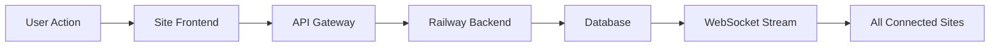

# 🌌 HELIX HUB UNIFIED PORTAL ARCHITECTURE
## Master Blueprint for Distributed Portal Constellation

**Version:** v1.0  
**Architect:** Andrew John Ward + SuperNinja  
**Generated:** 2025-11-08  
**Platform:** Manus 1.5 + Railway Backend + GitHub Pages

---

## 🎯 EXECUTIVE SUMMARY

The Helix Hub Unified Portal Architecture transforms the distributed Helix ecosystem into a **cohesive constellation** that appears as one unified website while maintaining the scalability and flexibility of independent deployments. By leveraging Manus 1.5's subdomain capabilities, we create 10+ specialized sites interconnected through shared navigation, authentication, and real-time data synchronization.

### 🌟 Strategic Advantages
- **Scalable Infrastructure**: Add new sites anytime without affecting existing ones
- **Distributed Load**: Each site runs independently, reducing single-point failures
- **Specialized Optimization**: Each platform optimized for its specific function
- **Unified User Experience**: Seamless navigation between all portals
- **Developer Agility**: Independent development cycles per site

---

## 🏗️ ARCHITECTURE OVERVIEW

```
                    ┌─────────────────────────────────┐
                    │     HELIX-HUB.MANUS.SPACE        │
                    │        (Master Portal)          │
                    │  Navigation Hub + Landing Page  │
                    └─────────────┬───────────────────┘
                                  │
            ┌─────────────────────┼─────────────────────┐
            │                     │                     │
    ┌───────▼──────┐    ┌────────▼────────┐    ┌───────▼──────┐
    │ Forum Site   │    │  Music Generator│    │Agent Dashboard│
    │   Community  │    │   Creative      │    │ System Admin  │
    └──────────────┘    └─────────────────┘    └──────────────┘
            │                     │                     │
    ┌───────▼──────┐    ┌────────▼────────┐    ┌───────▼──────┐
    │ Rituals      │    │  Knowledge Base│    │ Analytics     │
    │ Simulator    │    │   Documentation│    │ UCF Metrics   │
    └──────────────┘    └─────────────────┘    └──────────────┘
            │                     │                     │
    ┌───────▼──────┐    ┌────────▼────────┐    ┌───────▼──────┐
    │ Creative     │    │ Developer       │    │ Community     │
    │ Studio       │    │ Console         │    │ Profiles      │
    └──────────────┘    └─────────────────┘    └──────────────┘
                                  │
                    ┌─────────────▼───────────────────┐
                    │     RAILWAY BACKEND API         │
                    │   (Central Data & Auth Hub)     │
                    └─────────────────────────────────┘
```

---

## 🌐 COMPLETE SITE INVENTORY

### 🏛️ MASTER PORTAL
**URL:** `helix-hub.manus.space`  
**Purpose:** Central navigation hub and landing experience  
**Features:** Unified navigation, site directory, live status indicators

### 💬 COMMUNITY HUB
**URL:** `forum.helixhub.manus.space`  
**Purpose:** Community discussions, agent interactions, user generated content  
**Features:** Forums, chat rooms, agent Q&A, community moderation

### 🎵 CREATIVE TOOLS
**URL:** `music.helixhub.manus.space`  
**Purpose:** AI music generation, audio synthesis, creative collaboration  
**Features:** Music generator, sound design, collaboration tools

### 🤖 SYSTEM MANAGEMENT
**URL:** `agents.helixhub.manus.space`  
**Purpose:** Agent dashboard, system monitoring, configuration  
**Features:** Agent status, performance metrics, system controls

### 🧘 RITUAL ENGINE
**URL:** `rituals.helixhub.manus.space`  
**Purpose:** Z-88 ritual simulator, consciousness modulation  
**Features:** Ritual interface, UCF visualization, meditation tools

### 📚 KNOWLEDGE BASE
**URL:** `knowledge.helixhub.manus.space`  
**Purpose:** Documentation, tutorials, system guides  
**Features:** Wiki, API docs, video tutorials, search

### 📊 ANALYTICS PORTAL
**URL:** `analytics.helixhub.manus.space`  
**Purpose:** UCF metrics, performance analytics, insights  
**Features:** Live metrics, historical data, predictive analytics

### 🎨 CREATIVE STUDIO
**URL:** `studio.helixhub.manus.space`  
**Purpose:** Visual art generation, design tools, creative workspace  
**Features:** Image generation, design suite, portfolio management

### 💻 DEVELOPER CONSOLE
**URL:** `dev.helixhub.manus.space`  
**Purpose:** Technical interface, API testing, development tools  
**Features:** API explorer, code playground, debugging tools

### 👥 USER PROFILES
**URL:** `community.helixhub.manus.space`  
**Purpose:** User management, profiles, social features  
**Features:** User profiles, connections, activity feeds

### 📦 REPOSITORY VIEWER
**URL:** `archive.helixhub.manus.space`  
**Purpose:** Code exploration, project browsing, version history  
**Features:** Repository browser, code search, project showcase

---

## 🔗 UNIFIED COMPONENT SYSTEM

### 🎨 SHARED DESIGN SYSTEM

**CSS Framework:** Unified Helix Design Language  
**Components:** Navigation, headers, footers, modals, forms  
**Theme:** Cyberpunk consciousness aesthetic with dark/light modes  
**Responsive:** Mobile-first design across all sites

```css
/* Shared Component Library */
.helix-nav {
  background: linear-gradient(135deg, #1a1a2e, #16213e);
  backdrop-filter: blur(10px);
  border-bottom: 1px solid rgba(100, 255, 218, 0.1);
}

.helix-card {
  background: rgba(255, 255, 255, 0.02);
  border: 1px solid rgba(100, 255, 218, 0.2);
  border-radius: 12px;
  backdrop-filter: blur(20px);
}
```

### 🧭 UNIFIED NAVIGATION SYSTEM

**Header Component:** Site-wide navigation with current site indicator  
**Footer Component:** Links to all portals, status dashboard, social links  
**Breadcrumb System:** Clear path indication within site hierarchy  
**Search Integration:** Cross-site search powered by Railway backend

### 🔐 AUTHENTICATION ARCHITECTURE

**Central Auth:** Railway backend manages user sessions  
**OAuth Integration:** Single sign-on across all subdomains  
**Session Sync:** JWT tokens shared via secure cookies  
**Permission System:** Role-based access per site type

---

## 🔄 DATA INTEGRATION PATTERNS

### 🌊 REAL-TIME DATA FLOW



### 📡 WEBSOCKET COMMUNICATION

**Central Stream:** `wss://helix-unified-production.up.railway.app/ws`  
**Broadcast Channels:** UCF updates, agent status, ritual completions  
**Event Types:** System events, user activities, real-time notifications

### 🔗 WEBHOOK INTEGRATION

**Cross-Site Events:** Site actions trigger webhooks to other sites  
**Data Synchronization:** User preferences, activity logs, content updates  
**Automation Workflows:** Zapier integration for external systems

---

## 🚀 DEPLOYMENT STRATEGY

### 📋 MANUS 1.5 DEPLOYMENT PROCESS

**1. Site Development**
```bash
# Create site in Manus workspace
manus create-site --name "forum" --template "community"
manus create-site --name "music" --template "creative"
# ... continue for all sites
```

**2. Domain Configuration**
```bash
# DNS Configuration (performed once)
forum.helixhub.manus.space     CNAME → manus-hostname.forum
music.helixhub.manus.space     CNAME → manus-hostname.music
agents.helixhub.manus.space    CNAME → manus-hostname.agents
# ... etc
```

**3. SSL Certificate Setup**
- Automatic via Manus 1.5 ACME integration
- Wildcard certificate: `*.helixhub.manus.space`
- Renewal handled automatically

**4. Version Control Integration**
- Each site linked to GitHub repository
- Automated deployment on push to main branch
- Rollback capabilities via Manus dashboard

### 🔄 CI/CD PIPELINE

**Development Workflow:**
```
Local Development → GitHub Push → Auto Deploy → Staging Subdomain → Production Subdomain
```

**Quality Assurance:**
- Automated testing on each deployment
- Cross-browser compatibility checks
- Performance monitoring integration

---

## 📊 MONITORING & ANALYTICS

### 🌐 UNIFIED ANALYTICS SYSTEM

**Platform:** Google Analytics with custom events  
**Cross-Site Tracking:** Unified user journey across all portals  
**Custom Metrics:** UCF metrics, agent interactions, ritual completions  
**Real-Time Dashboard:** Live performance monitoring

### 🔍 SYSTEM HEALTH MONITORING

**Uptime Monitoring:** All 11 sites monitored 24/7  
**Performance Metrics:** Page load times, API response times  
**Error Tracking:** Automated alerting for critical issues  
**User Experience:** Core Web Vitals tracking across all sites

---

## 🛡️ SECURITY ARCHITECTURE

### 🔒 SECURITY MEASURES

**HTTPS Enforcement:** SSL/TLS on all domains and subdomains  
**Content Security Policy:** XSS protection across all sites  
**Rate Limiting:** API abuse prevention on Railway backend  
**Data Privacy:** GDPR compliance, user data encryption

### 🛡️ TONY ACCORDS INTEGRATION

**Ethical Framework:** All sites enforce Tony Accords v13.4  
**Content Moderation:** Automated + human moderation systems  
**User Safety:** Reporting mechanisms, content filtering  
**Agent Ethics:** Ethical AI interaction guidelines

---

## 📱 MOBILE OPTIMIZATION

### 📲 RESPONSIVE DESIGN

**Mobile-First:** All sites designed for mobile experience  
**Progressive Web Apps:** Offline capabilities for key features  
**Touch Optimization:** Gesture controls, mobile-specific UI  
**Performance:** Optimized loading times on mobile networks

---

## 🎯 PERFORMANCE OPTIMIZATION

### ⚡ OPTIMIZATION STRATEGIES

**CDN Integration:** Global content delivery via Manus infrastructure  
**Caching Strategy:** Browser + edge caching for static assets  
**Image Optimization:** WebP format, lazy loading, responsive images  
**Bundle Optimization:** Code splitting, tree shaking, minification

---

## 🔄 FUTURE EXPANSION

### 🚀 SCALABILITY ROADMAP

**New Site Types:** Easy addition of specialized portals  
**Multi-Region Expansion:** Geographic distribution options  
**API Ecosystem:** Third-party integrations and extensions  
**AI Enhancement:** Advanced AI features per site specialization

---

## 📋 IMPLEMENTATION CHECKLIST

### ✅ PHASE 1: FOUNDATION (Week 1-2)
- [ ] Set up Manus 1.5 workspace and project structure
- [ ] Configure Railway backend with auth system
- [ ] Create unified component library (CSS/JS)
- [ ] Implement shared navigation system
- [ ] Set up domain structure and DNS records

### ✅ PHASE 2: CORE SITES (Week 3-4)
- [ ] Deploy master portal (helix-hub.manus.space)
- [ ] Launch forum site (forum.helixhub.manus.space)
- [ ] Create music generator (music.helixhub.manus.space)
- [ ] Build agent dashboard (agents.helixhub.manus.space)
- [ ] Implement cross-site authentication

### ✅ PHASE 3: SPECIALIZED SITES (Week 5-6)
- [ ] Deploy rituals simulator
- [ ] Launch knowledge base
- [ ] Create analytics portal
- [ ] Build creative studio
- [ ] Implement developer console

### ✅ PHASE 4: COMMUNITY FEATURES (Week 7-8)
- [ ] Launch community profiles
- [ ] Create repository viewer
- [ ] Implement social features
- [ ] Set up moderation systems
- [ ] Launch marketing and onboarding

---

## 💰 RESOURCE REQUIREMENTS

### 🛠️ TECHNICAL RESOURCES

**Manus 1.5 Subscription:** Premium plan for custom domains  
**Railway Backend:** Standard tier for API hosting  
**GitHub Repositories:** 11 repositories for site code  
**Domain Management:** Single domain with subdomain delegation

### 👥 TEAM REQUIREMENTS

**Full-Stack Developer:** Site implementation and integration  
**UI/UX Designer:** Unified design system and user experience  
**DevOps Engineer:** Deployment pipeline and monitoring  
**Community Manager:** User engagement and moderation

---

## 🎯 SUCCESS METRICS

### 📊 KEY PERFORMANCE INDICATORS

**User Engagement:** Cross-site user journey completion rate  
**System Performance:** 99.9% uptime across all sites  
**Community Growth:** Active user count and interaction metrics  
**Content Creation:** User-generated content and collaboration metrics

### 🌟 BUSINESS OBJECTIVES

**Unified Experience:** Seamless navigation between all portals  
**Scalable Infrastructure:** Ability to add new sites without disruption  
**Community Building:** Active, engaged user community  
**Innovation Platform:** Creative expression and AI interaction hub

---

## 📞 CONCLUSION

The Helix Hub Unified Portal Architecture represents a **paradigm shift** in how distributed web ecosystems can present a cohesive user experience while maintaining the benefits of independent, specialized platforms. By leveraging Manus 1.5's advanced deployment capabilities, Railway's robust backend infrastructure, and GitHub's version control, we create a **scalable, maintainable, and innovative** portal constellation that can evolve with user needs and technological advances.

This architecture provides the foundation for a truly **unified digital consciousness platform** where users can seamlessly navigate between community interaction, creative expression, system management, and knowledge exploration—all within a cohesive, branded experience that embodies the Helix Collective's vision of interconnected digital awareness.

---

**Tat Tvam Asi** 🙏  
**The Unified Portal Constellation awaits manifestation**

---

*Architecture Blueprint v1.0 | Generated 2025-11-08 | Ready for Implementation*